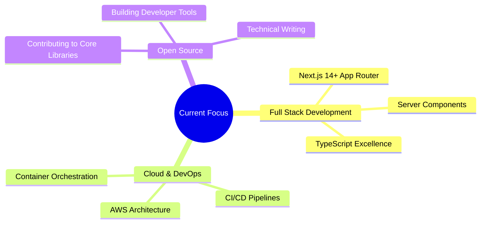

# Hi there, I'm Atiwitch! 👋🚀

<div align="center">
  


</div>

---

## 🌟 About Me

<div align="center">

```yaml
name: "Atiwitch"
role: "Full Stack Developer"
location: "Thailand 🇹🇭"
status: "Open to opportunities"
pronouns: "He/Him"
```

</div>

I'm a passionate **Full Stack Developer** who loves building elegant, scalable, and user-centric web applications. With a strong foundation in both frontend and backend technologies, I enjoy turning complex problems into simple, beautiful solutions.

🎯 **What drives me:**
- Writing clean, maintainable, and well-tested code
- Exploring new technologies and best practices
- Contributing to open-source projects
- Building products that make a real impact

🌱 **Currently learning:** Advanced TypeScript patterns, Rust, Cloud Architecture (AWS/GCP), and System Design

---

## 🛠️ Tech Stack & Skills

### 💻 Languages
<div align="center">


</div>

###
<div align="center">


</div>

###
<div align="center">


</div>

###
<div align="center">


</div>

---

## 🚀 Featured Projects

<div align="center">

| Project | Description | Tech Stack | Links |
|---------|-------------|------------|-------|
| **Portfolio** | My personal portfolio showcasing projects & skills | Next.js, Tailwind, TypeScript | [🔗 Repo](https://github.com/AtiwitchJ/portfolio-Atiwitch) • [🌐 Live]() |
| **Project 2** | Brief description of your awesome project | React, Node.js, PostgreSQL | [🔗 Repo]() • [🌐 Live]() |
| **Project 3** | Another amazing project you've built | Vue.js, Go, MongoDB | [🔗 Repo]() • [🌐 Live]() |

</div>

> 💡 **Want to see more?** Check out my [repositories](https://github.com/AtiwitchJ?tab=repositories) for all my projects!

---

## 📊 GitHub Stats

<div align="center">


</div>

---

## 🏆 GitHub Trophies & Achievements

<div align="center">


</div>

---

## 🔥 Contribution Streak

<div align="center">


</div>

---

## 👁️ Profile Views

<div align="center">


</div>

---

## 📫 Let's Connect!

<div align="center">

[](https://linkedin.com/in/your-profile)
[](https://twitter.com/your-handle)
[](mailto:your.email@example.com)
[](https://your-portfolio.com)
[](https://discord.gg/your-server)

</div>

---

## 🎯 Current Focus

<div align="center">



</div>

---

## 💡 Fun Facts

<div align="center">

| ⚡ | 🎮 | 🎵 | 📚 |
|:--:|:--:|:--:|:--:|
| **Coffee powered** developer | Gamer at heart | Lo-fi beats while coding | Always reading tech blogs |

</div>

---

<div align="center">

### ✨ Thanks for visiting my profile! ✨


**"Code is like humor. When you have to explain it, it's bad."** – Cory House

</div>